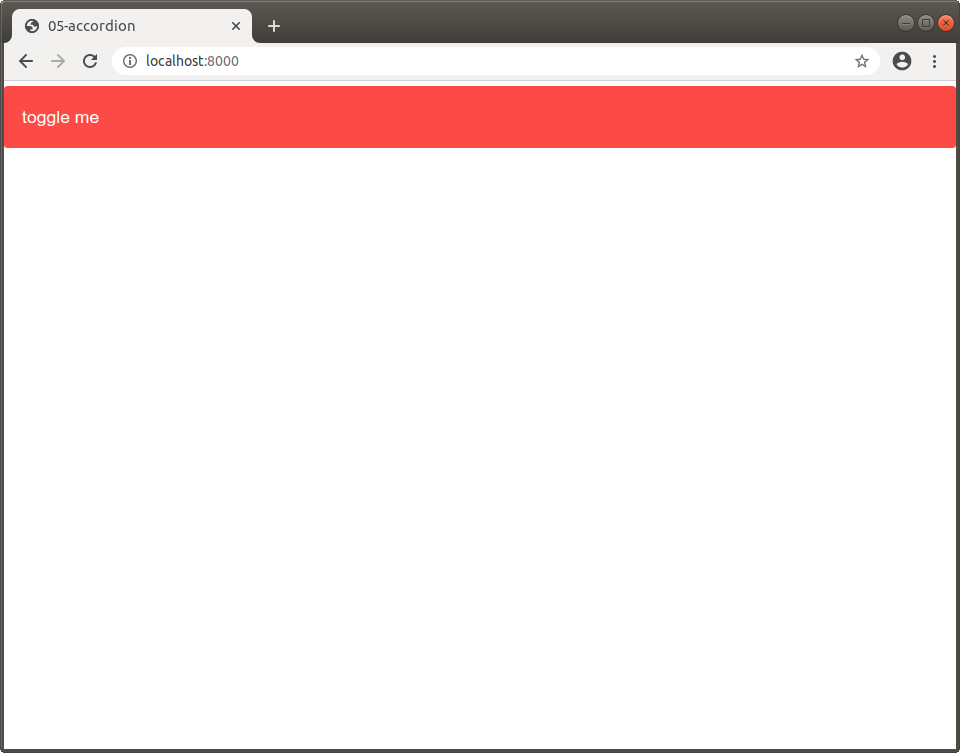
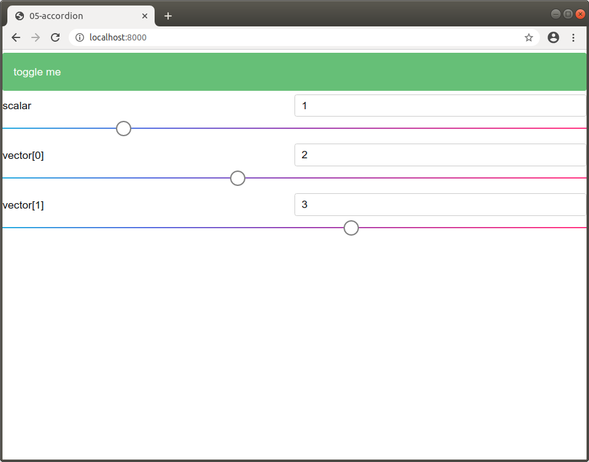

The `sai-interfaces-accordion` Element
=======================================
The `sai-interfaces-accordion` element is an accordion that is hooked up to a 
Redis key. An accordion, in the UI world, is an element that can be toggled to 
show or hide content. See 
[here](https://semantic-ui.com/modules/accordion.html#/definition) for more 
examples of accordions.

The `sai-interfaces-accordion` element uses a Redis key that is always 0 
(false) or 1 (true) to determine if it should display its contents. This is 
particularly useful in situations such as showing interpolation-related options 
only when interpolation is enabled.

## Usage

```
<sai-interfaces-accordion key="..." displayName="...">
  <element></element>
  <element></element>
  <element></element>
  ...
</sai-interfaces-accordion>
```

## Attributes

* `key`: Optional. When the accordion is toggled (contents shown and green fill), the key will be set to 1.
When it is not toggled (contents not shown and red fill), the key is set to zero.
If the key already exists, it will be used for the initial state of the accordion. Otherwise, the accordion is not toggled by default, and the key will be set the first time the accordion is clicked.
* `displayName`: Optional. This text is what is shown as the accordion header. If not present, the key is used

## Example

For our example, we're going to use `sai::interfaces::tutorial::toggle_key` to 
determine if we should show the accordion or not. We will show sliders when the 
toggle key is set to true. The corresponding HTML is below:

```
<sai-interfaces-accordion key="sai::interfaces::tutorial::toggle_me" 
  displayName="toggle me">
  <sai-interfaces-slider key="sai::interfaces::tutorial::scalar_key" 
    display="scalar" min="0" max="5" step="0.1">
  </sai-interfaces-slider>
  <sai-interfaces-slider key="sai::interfaces::tutorial::vector_key" 
    display="vector" min="0" max="5" step="[0.1,0.1]">
  </sai-interfaces-slider>
</sai-interfaces-accordion>
```

If you are not familar with the `sai-interfaces-slider` syntax, please read 
through [its documentation here](../slider/slider.md).

First, let's make sure our keys are in redis. There's a helper script in this 
folder that you can run to do this:

```
python3 docs/ui_elements_details/ui_elements_details/accordion/writekeys.py
```

Next, we run the server as follows:

```
~/sai/core/sai-interfaces$ python3 ui/server.py docs/ui_elements_details/accordion/accordion.html 
```

Open your browser to `localhost:8000` and you should see something like this:



Click the "toggle me" text, and you should be able to see it turn green and 
multiple sliders show up:



We can verify the `sai::interfaces::tutorial::toggle_key` has been updated 
correctly:

```
~/sai/core/sai-interfaces$ redis-cli
127.0.0.1:6379> get sai::interfaces::tutorial::toggle_me
"1"
127.0.0.1:6379> 
```

And that's pretty much it - you can place whatever HTML or SAI-Interfaces 
component within the `sai-interfaces-accordion` element!
