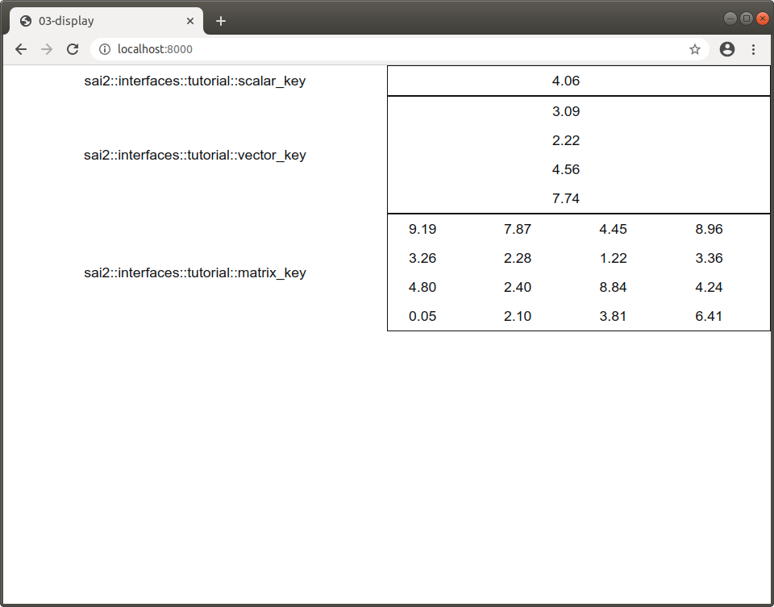

The `sai-interfaces-display` Element
=====================================
The `sai-interfaces-display` element allows you to see the value of a single 
scalar-valued, vector-valued, or matrix-valued Redis key at the specified refresh rate.

## Usage
```
<sai-interfaces-display key="..." refreshRate="..." decimalPlaces="...">
</sai-interfaces-display>
```

## Attributes
* `key`: Required. This is what Redis key to display. If this key does not exist
within Redis, the element will not show.
* `refreshRate`: Optional. How often to refresh the display in seconds (1 by default). 
Don't make this too fast - if you want to observe key values at a 
faster rate, use the [plot](../plot/README.md) element, or log data for leter plotting.
* `decimalPlaces`: Optional. How many decimal places to display (3 by default).
* `displayAsRowVector`: Optional. If this attribute is present and the key is a vector,
it will be shown as a row vector.
* `labelOnTop`: Optional. If this attribute is present, the label will be shown on top of the values displayed.
Otherwise it will be on the left
## Example

We have provided a Python script that will write to three keys called 
`sai::interfaces::tutorial::scalar_key`, `sai::interfaces::tutorial::vector_key`,
and `sai::interfaces::tutorial::matrix_key`. The `vector_key` will have a vector
with 4 elements, and the `matrix_key` will hold a 4x4 matrix.

Let's run the script first:
```
~/sai/core/sai-interfaces$ python3 docs/ui_elements_details/display/writekeys.py 
Writing keys...
```

Since this Python script will generate random floats between 0 and 10 at 10Hz,
let's set our refresh rate also to 1 refresh per second and the number of 
decimal places to 2 for nicer output.

Now let's write the HTML to display these keys:
```
<sai-interfaces-display key="sai::interfaces::tutorial::scalar_key" refreshRate="1" decimalPlaces="2" />
<sai-interfaces-display key="sai::interfaces::tutorial::vector_key" refreshRate="1" decimalPlaces="2" />
<sai-interfaces-display key="sai::interfaces::tutorial::matrix_key" refreshRate="1" decimalPlaces="2" />
```




You can optionally show the vector as a row-vector. You can show turn it into a
row vector below:
```
<sai-interfaces-display key="sai::interfaces::tutorial::vector_key" 
	refreshRate="1" decimalPlaces="2" displayAsRowVector/>
```

You can also show the label on top of the matrix:
```
<sai-interfaces-display key="sai::interfaces::tutorial::matrix_key" 
	refreshRate="1" decimalPlaces="2" labelOnTop/>
```