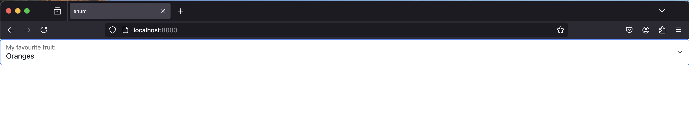

The `sai-interfaces-enum` Element
==================================
The `sai-interfaces-enum` element lets you set specific values into a Redis 
key, i.e. an `enum` type in most languages.

## Usage
```
<sai-interfaces-enum key="..." display="..." values='["a","b","c"]'>
<sai-interfaces-enum>
```

Specify each valid option as value in the array of `values`. If the values are strings,
it is important to have single quatation marks around the array brackets, and double
quotation marks around each string element of the array (e.g. `'["a", "b", "c"]'`). If
the values are numbers, the array can be defined with only qutation marks, simple or double,
around the array brackets (e.g. `"[1,2,3,4]"`). 

## Attributes
* `key`: Required. Specifies which Redis key to get/set to the user-specified options.
* `values`: Required. The values that the enum can take.
* `display`: Optional. Specifies what text to put in the dropdown menu. If not provided, the key will be used

## Example
Open up `redis-cli`, and let's set the key 
`sai::interfaces::tutorial::enum_key` to "Apples". Let's say that the valid 
options for this key are `Apples`, `Bananas`, or `Oranges`.
```
~$ redis-cli
127.0.0.1:6379> set sai::interfaces::tutorial::enum_key Apples
OK
127.0.0.1:6379> get sai::interfaces::tutorial::enum_key
"Apples"
127.0.0.1:6379> 
```

Let's write the HTML for this and paste it into the body of 
[enum.html](./enum.html)
```
<sai-interfaces-enum key="sai::interfaces::tutorial::enum_key"
	values='["Apples", "Bananas", "Oranges"]' />
```

We launch our server from the SAI-Interfaces repository root.
```
~/sai/core/sai-interfaces$ python3 ui/server.py docs/ui_elements_details/enum/enum.html
 * Restarting with stat
 * Debugger is active!
 * Debugger PIN: 142-257-956
(12039) wsgi starting up on http://127.0.0.1:8000
```

Open your browser to `localhost:8000`, and you should see something like this:


Select the `Oranges` option in the dropdown, and we should be able to see the 
Redis key update:
```
127.0.0.1:6379> get sai::interfaces::tutorial::enum_key
"Oranges"
127.0.0.1:6379> 
```

We can also change the associated text next to the dropdown by using the 
`display` attribute:
```
<sai-interfaces-enum key="sai::interfaces::tutorial::enum_key" display="My favourite fruit:"
	values='["Apples", "Bananas", "Oranges"]' />
```

After refreshing the webpage, you should see something like this:


