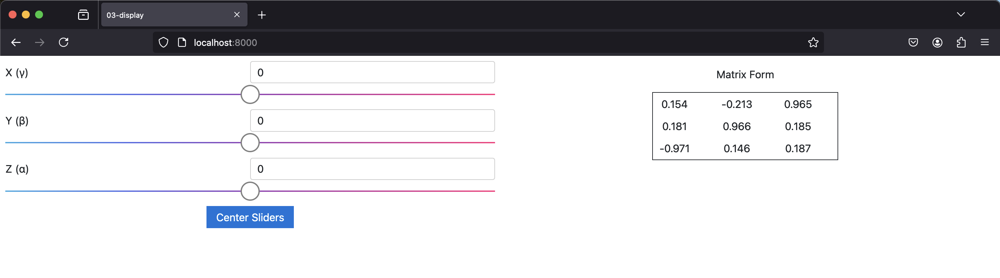
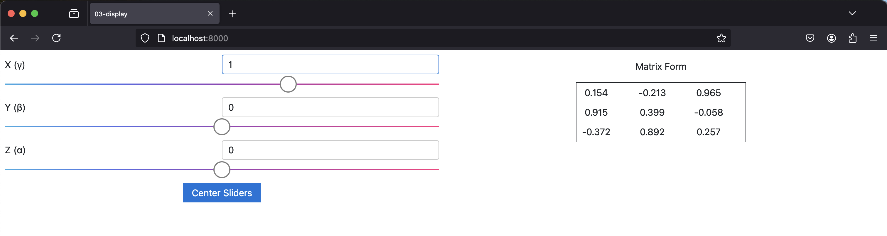

The `sai-interfaces-orientation` Element
====================================
The `sai-interfaces-orientation` element allows for a more intuitive control of 
orientation by letting the user tune relative offsets to the current orientation.
You will find it used in the motion-force task ui element used to perform cartesian
control of a robot.

## Usage

```
<sai-interfaces-orientation key="..." refreshRate="">
</sai-interfaces-orientation>
```

## Attributes

* `key`: Required. The Redis key that has a rotation matrix. If the Redis key
does not exist, the display part will not appear and the matrix will not be set to redis.
* `refreshRate`: Optional. Refresh rate of the current rotation matrix display (1 second by default).

## Example

We have provided a [script](./writekeys.py) that will generate a random
XYZ fixed-angle orientation and print it periodically. Our goal is to use
the `sai-interfaces-orientation` module to observe that we can indeed specify
relative orientations and see the effect on the rotation matrix.

So, within the HTML body of the [provided HTML file](./orientation.html), 
we add the following HTML code:

```
<sai-interfaces-orientation key="sai::interfaces::tutorial::matrix_key" refreshRate="1"/>
```

This means to use the `sai::interfaces::tutorial::matrix_key` as our rotation matrix, 
and to read it every second.

If we run the server, we should see something like this (the values will be different each time):



From here, we can use the sliders to generate offsets:



We also see the change in angles from the provided Python script:
