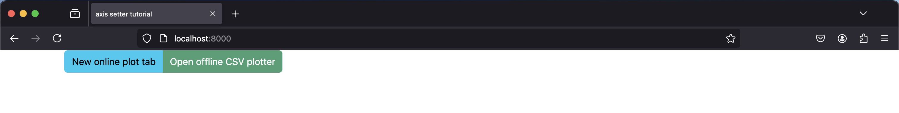
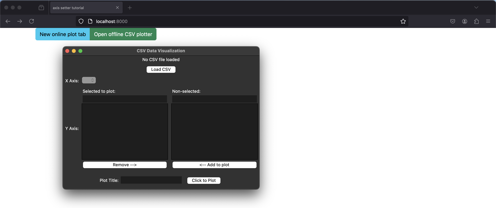

The `sai-interfaces-plot-button` Element
=========================================
The `sai-interfaces-plot-button` element makes a double button



* Clicking the left part will open a new tob with a [plot](../plot/README.md) element
* Clicking the right part will open a python program to load a csv file and plot its contents

## Usage

```
<sai-interfaces-plot-button/>
```

## Attributes

There are no attributes

## Example

We provide an [example HTML file](./plot_button.html) containing the following html code:

```
<sai-interfaces-plot-button/>
```

Run the server:

```
~/sai/core/sai-interfaces$ python3 ui/server.py docs/ui_elements_details/plot_button/plot_button.html 
```

Open a browser and go to `localhost:8000` .
Press the left button to open a new tab with a [plot](../plot/README.md) element
Press the right button to open the csv plotter program:




