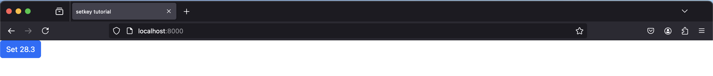

The `sai-interfaces-setkey` Element
====================================
The `sai-interfaces-setkey` element created a button that sets a redis key to a predefined value when the button is pressed

## Usage
```
<sai-interfaces-setkey key="..." value="..." display="...">
</sai-interfaces-setkey>
```

## Attributes
* `key`: Required. The key to set when the button is pressed.
* `value`: Required. The value to set when the button is pressed.
* `display`: Optional. Specifies what text to put on the button. By default, the text will be "set `key` to `value`" 

## Example
The [example HTML file](./setkey.html) contains the following:
```
<sai-interfaces-setkey key="sai::interfaces::tutorial::setkey" value="28.3" display="Set 28.3"/>
```

Start the server
```
~/sai/core/sai-interfaces$ python3 ui/server.py docs/ui_elements_details/setkey/setkey.html 
```

Open a browser and navigate to `localhost:8000` and you should see:


Open up `redis-cli`, and let's set the key
`sai::interfaces::tutorial::setkey` to some value like 7:
```
~$ redis-cli
127.0.0.1:6379> set sai::interfaces::tutorial::setkey 7
OK
127.0.0.1:6379> get sai::interfaces::tutorial::setkey
"7"
```

Now press the button in the web browser, and the key should have changed
```
~$ redis-cli
127.0.0.1:6379> get sai::interfaces::tutorial::setkey
"28.3"
```
