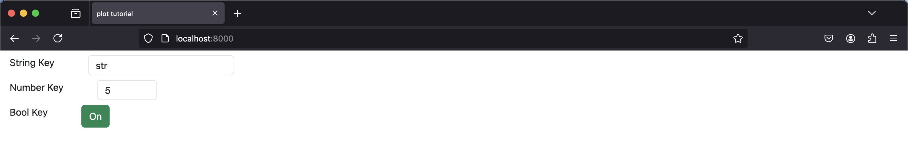

The `sai-interfaces-simple-data-structure-setter` Element
==========================================================
The `sai-interfaces-simple-data-structure-setter` element provides a convenient way to set values for a data sctructure that can contain string, numbers or boolean values. The data structure can be easily parsed to a dict in python using json, or in a custom c++ struct using [Glaze](https://github.com/stephenberry/glaze) or similar libraries.

## Usage
```
<sai-interfaces-simple-data-structure-setter key="..." />
```

## Attributes
* `key`: Required. The key that will contain the data structure. If it does not exist, the element will not appear

## Example

Let's start by first running the provided [writekeys.py](./writekeys.py) script:
```
~/sai/core/sai-interfaces$ python3 docs/ui_elements_details/simple_data_structure_setter/writekeys.py 
```

Now let's start up the interface:
```
~/sai/core/sai-interfaces$ python3 ui/server.py docs/ui_elements_details/simple_data_structure_setter/simple_data_structure_setter.html 
```

In a web browser, navigate to `localhost:8000`, you should see



Change the values of the different elements


You can see the values changed in the redis database
```
~$ redis-cli
127.0.0.1:6379> get sai::interfaces::tutorial::simple_data_structure
"{\"string_key\":\"new string\",\"number_key\":15.5,\"bool_key\":false}"
```