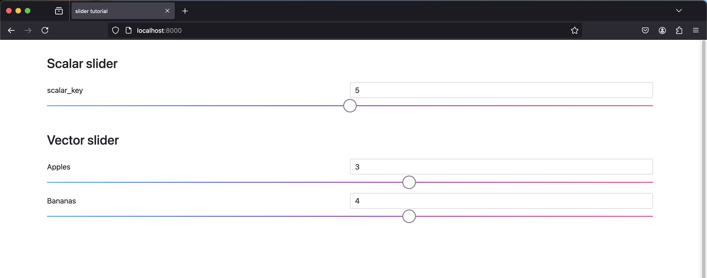

The `sai-interfaces-slider` Element
====================================
The `sai-interfaces-slider` element allows you to get/set the values of a 
scalar or vector tied to the Redis key.

## Usage

```
<sai-interfaces-slider key="..." min="..." max="..." step="...">
</sai-interfaces-slider>
```

If you specify a vector-valued key with `n` elements, `sai-interfaces-slider`

will create `n` sliders, one for each element.

## Attributes

* `key`: Required if you are reading from Redis. The key for which to create a slider. 
Can be a scalar or vector. If this Redis key does not exist, it will be created as a 
scalar key in the redis database.
* `size`: Required if making a slider in memory. This is the number of sliders to
generate; i.e. 1 for a scalar, 2 for a 2D vector etc. This is useful if you're
creating a new sai-interfaces component using a slider, like the 
[sai-interfaces-orientation](../orientation/README.md) component.
* `display`: Optional. The friendly display name. If omitted, the default will 
be the `key` . If you have a vector-valued key, the name will be the value 
provided `display` plus an index, e.g. `display_name[0]` .
* `min`: Required. The minimum value for the scalar or vector. If you have a 
vector-valued key, you can specify a minimum value for each element in the 
vector.
* `max`: Required. The maximum value for the scalar or vector. If you have a 
vector-valued key, you can specify a maximum value for each element in the 
vector.
* `step`: Optional. The amount to increment the slider value by when you drag 
the slider. If you have a vector-valued key, you can specify the step for each
element in the vector. Note that if there is no step provided, or if the provided
step is too large, the step will automatically be set to 1/1000 of the difference
between min and max.

## Example

Since sliders can handle both scalar-valued and vector-valued Redis keys, 
let's do two examples. We'll start a scalar key called 
`sai::interfaces::tutorial::scalar_key` and set it to `5` .

Similarly, we'll create a vector key called 
`sai::interfaces::tutorial::vector_key` and set it to `[3,4]` . 

You can set them via the provided `writekeys.py` script

```
~/sai/core/sai-interfaces$ python3 docs/ui_elements_details/slider/writekeys.py
```

or directly from the terminal redis-cli program:

```
~/sai/core/sai-interfaces$ redis-cli
127.0.0.1:6379> set sai::interfaces::tutorial::scalar_key 5
OK
127.0.0.1:6379> set sai::interfaces::tutorial::vector_key [3,4]
OK
127.0.0.1:6379> get sai::interfaces::tutorial::scalar_key
"5"
127.0.0.1:6379> get sai::interfaces::tutorial::vector_key
"[3,4]"
127.0.0.1:6379> 
```

Let's make a scalar and a vector slider in the same webpage.
Let's limit our scalar key to be between 0 and 10. Let's omit the step size so it will be automatically set to 0.01
and we'll give a friendly name while we're at it. This HTML should look like 
this:

```
<sai-interfaces-slider key="sai::interfaces::tutorial::scalar_key"
  display="scalar_key" min="0" max="10">
</sai-interfaces-slider>
```

Let's limit the element in the vector be from 0 to 5 and 1 to 6 respectively, and the step size to
be 0.005 and 0.001 respectively. With a custom name for each element, our HTML for a vector-valued key 
should look like this:

```
<sai-interfaces-slider key="sai::interfaces::tutorial::vector_key" display='["Apples","Bananas"]'
	min="[0,1]" max="[5,6]" step="[0.005,0.001]">
</sai-interfaces-slider>
```

Let's start up the server now.

```
~/sai/core/sai-interfaces$ python3 ui/server.py docs/ui_elements_details/slider/slider.html 
 * Restarting with stat
 * Debugger is active!
 * Debugger PIN: 142-257-956
(31058) wsgi starting up on http://127.0.0.1:8000
```

Open your browser to `localhost:8000` , and you should see something like this:



You can drag the sliders back and forth or manually input what value you want in the input textbox.


Note that if you wanted all the elements of the vector slider to have the same min, max and step, you could define it like this:
```
<sai-interfaces-slider key="sai::interfaces::tutorial::vector_key" display='["Apples","Bananas"]'
	min="0" max="10" step="0.005">
</sai-interfaces-slider>
```

You can try to modify the [html file](./slider.html) of the example and refresh the web browser page to see the changes.