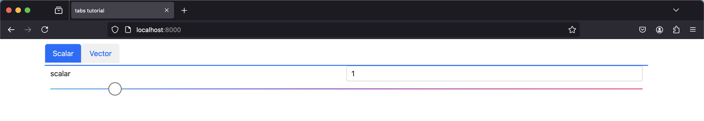
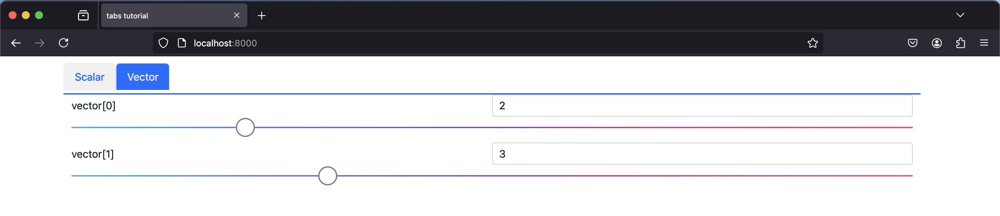
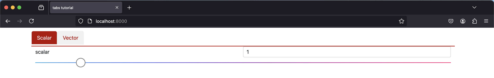
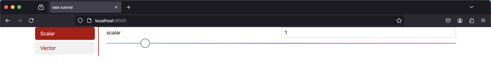

The `sai-interfaces-tabs` Element
==========================================
The `sai-interfaces-tabs` element is a container that enable to switch between multiple contents using tabs. The tabs are based on bootstrap tab elements.
* The tabs can be placed on the top (by default) or the left.
* The tabs can be connected to a redis key such that the value change depending on which tab is activated
* The tab color can be changed
* Additional content can be added to the tab area

## Usage

```
<sai-interfaces-tabs name="..." key="..." color="...">
	<sai-interfaces-tab-content name="..." value="...">
		...
	</sai-interfaces-tab-content>
	<sai-interfaces-tab-content name="..." value="...">
		...
	</sai-interfaces-tab-content>
</sai-interfaces-tabs>
```

The elements placed inside each `sai-interfaces-tab-content` tags will show when that tab is selected.

## Attributes

For the `sai-interfaces-tabs` element:
* `name`: Required.
* `key`: Optional. If the key attribute is provided, the values of the `sai-interfaces-tab-content` elements will be set to the redis database in this key when the corresponding tab is clicked.
* `color`: Optional. To select the color of the tabs. Must be provided as `'rgb(0,0,0)'` format or `'#f4f4f4'` format. Default value is `'rgb(0, 110, 255)'`
* `tabsOnTheLeft`: Optional. If present, the tabs will be on the left of the contents. Otherwise, they will be on the top.

For the `sai-interfaces-tab-content` elements:
* `name`: Required. This is the name that will appear on the tab button itself
* `value`: Optional. If a key is provided to the `sai-interfaces-tabs` element, the value provided here will be set to the key when the tab is clicked

## Example

For this example, we're going show a slider for 
`sai::interfaces::tutorial::scalar_key` when the **Scalar** tab is selected and a 
slider for `sai::interfaces::tutorial::vector_key` when the **Vector** tab is selected.
The corresponding [HTML](./tabs.html) is below:

```
<sai-interfaces-tabs name="tabs">
	<sai-interfaces-tab-content name="Scalar">
		<sai-interfaces-slider key="sai::interfaces::tutorial::scalar_key" display="scalar" min="0"
			max="10" />
	</sai-interfaces-tab-content>
	<sai-interfaces-tab-content name="Vector">
		<sai-interfaces-slider key="sai::interfaces::tutorial::vector_key" display="vector" min="0"
			max="10" />
	</sai-interfaces-tab-content>
</sai-interfaces-tabs>
```

First, let's make sure our keys are in redis. There's a helper script in this 
folder that you can run to do this:

```
~/sai/core/sai-interfaces$ python3 docs/ui_elements_details/tabs/writekeys.py 
```

Now let's boot up the server:

```
~/sai/core/sai-interfaces$ python3 ui/server.py docs/ui_elements_details/tabs/tabs.html 
```

Open up your browser to `localhost:8000` , and you should see something like this:



Click on the `Vector` tab and you should see:



If you want to change the color of the tabs, you can add `color='#b30000'` to the attributes of the `sai-interfaces-tabs` element.

```
<sai-interfaces-tabs name="tabs" color='#b30000'>
```

Refresh the page to see:


To place the tabs on the left, add the `tabsOnTheLeft` attribute:

```
<sai-interfaces-tabs name="tabs" color='#b30000' tabsOnTheLeft>
```

Refresh the page to see:


Finally, you can attach the tabs to a redis key. Add the `key` attribute to the `sai-interfaces-tabs` element, and a `value` attribute to all the `sai-interfaces-tab-content` elements. Replace the HTML with:

```		
<sai-interfaces-tabs name="tabs" key="sai::interfaces::tutorial::tab_key">
	<sai-interfaces-tab-content name="Scalar" value="scalar">
		<sai-interfaces-slider key="sai::interfaces::tutorial::scalar_key" display="scalar" min="0"
			max="10" />
	</sai-interfaces-tab-content>
	<sai-interfaces-tab-content name="Vector" value="vector">
		<sai-interfaces-slider key="sai::interfaces::tutorial::vector_key" display="vector" min="0"
			max="10" />
	</sai-interfaces-tab-content>
</sai-interfaces-tabs>
```

Refresh the page, switch the tab, and check that the correct value was set to the redis key in the database:
```
~$ redis-cli
127.0.0.1:6379> get sai::interfaces::tutorial::tab_key
```