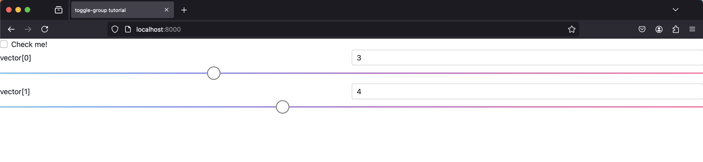
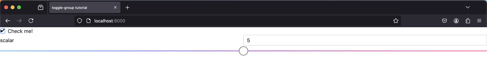

The `sai-interfaces-toggle-group` Element
==========================================
The `sai-interfaces-toggle-group` element is a container that can switch
between two different sets of elements based on a checkbox, which may or may not be controlled by a Redis key.

More concretely, suppose you have a checkbox element. If it's checked, you 
display a group of elements. If the box is not checked, you display a different 
group of elements. This checkbox can be connected to a Redis key, but it does 
not need to be.

## Usage
```
<sai-interfaces-toggle-group name="...">
  <sai-interfaces-toggle-group-enabled>
    <element></element>
    <element></element>
    <element></element>
    ...
  </sai-interfaces-toggle-group-enabled>
  <sai-interfaces-toggle-group-disabled>
    <element></element>
    <element></element>
    <element></element>
    ...
  </sai-interfaces-toggle-group-disabled>
</sai-interfaces-toggle-group>
```

You must place all elements in the `sai-interfaces-toggle-group-enabled` 
element if you want them to show when the checkbox is checked. Similarly, place 
all elements in the `sai-interfaces-toggle-group-disabled` element if you want 
them to show when the checkbox is *not* checked.

## Attributes
* `name`: Required. This is the text that is displayed next to the checkbox and 
is thus used to identify the toggle group on the interface.
* `key`: Optional. The checkbox can be hooked up to a Redis key that holds a 
boolean value. Otherwise, the checkbox value is held in memory and is 
initialized to unchecked. If the key is present but does not exists in the redis
database, then the checkbox starts unckecked and the key will be set the first 
time the checkbox is clicked
* `enabled`: Optional. If the toggle group is not
attached to a redis key, or if the redis key does not exist,
this will initialize the checkbox to enabled. 
If ommited, the checkbox will be unchecked by default

## Example
For this example, we're going show a slider for 
`sai::interfaces::tutorial::scalar_key` when the checkbox is checked and a 
slider for `sai::interfaces::tutorial::vector_key` when the checkbox is not 
checked. The corresponding HTML is below:
```
<sai-interfaces-toggle-group name="Check me!">
	<sai-interfaces-toggle-group-enabled>
		<sai-interfaces-slider key="sai::interfaces::tutorial::scalar_key" display="scalar" min="0" max="10"/>
	</sai-interfaces-toggle-group-enabled>
	<sai-interfaces-toggle-group-disabled>
		<sai-interfaces-slider key="sai::interfaces::tutorial::vector_key" display="vector" min="0" max="10"/>
	</sai-interfaces-toggle-group-disabled>
</sai-interfaces-toggle-group>
```

First, let's make sure our keys are in redis. There's a helper script in this 
folder that you can run to do this:
```
~/sai/core/sai-interfaces$ python3 docs/ui_elements_details/toggle-group/writekeys.py 
```

Now let's boot up the server:
```
~/sai/core/sai-interfaces$ python3 ui/server.py docs/ui_elements_details/toggle-group/toggle-group.html 
```

Open up your browser to `localhost:8000`, and you should see something like 
this:



As expected, when the checkbox is not checked, we show the sliders for the 
`sai::interfaces::tutorial::vector_key` Redis key. 

Now let's click the checkbox. You should see the slider switch to the 
`sai::interfaces::tutorial::scalar_key`:



Finally, you can add the `key="sai::interfaces::tutorial::toggle_me"` attribute
to the `sai-interfaces-toggle-group` element in 
[toggle-group.html](./toggle-group.html). You should see the checkbox 
value in the redis database, and it will persist across webpage refreshes.
