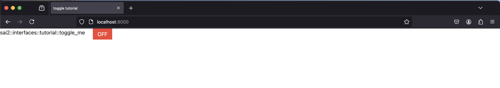
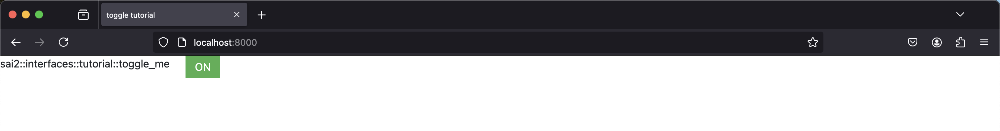
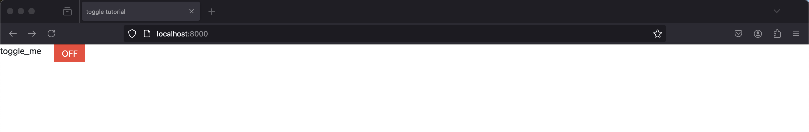

The `sai-interfaces-toggle` Element
====================================
The `sai-interfaces-toggle` element allows you to toggle a Redis key between 0 
(false) and 1 (true). 

## Usage
```
<sai-interfaces-toggle key="...">
</sai-interfaces-toggle>
```

## Attributes
* `key`: Required. Specifies which Redis key to set for toggling. If the 
Redis key does not exist, the toggle will start in OFF mode and the key 
will be set the first time the toggle is clicked
* `display`: Optional. Specifies what text to put next to the toggle button. 
Default is the key name.

## Example
Open up `redis-cli`, and let's set the key 
`sai::interfaces::tutorial::toggle_me` to the value 1:
```
~$ redis-cli
127.0.0.1:6379> set sai::interfaces::tutorial::toggle_me 1
OK
127.0.0.1:6379> get sai::interfaces::tutorial::toggle_me
"1"
127.0.0.1:6379> 
```

Now let's see the toggle element in action. If we put the following in the 
`<body></body>` tags of [toggle.html](./toggle.html):
```
<sai-interfaces-toggle key="sai::interfaces::tutorial::toggle_me">
</sai-interfaces-toggle>
```

and then we run the following in a separate terminal at the `sai-interfaces` 
repository root:
```
~/sai/core/sai-interfaces$ python3 ui/server.py docs/ui_elements_details/toggle/toggle.html 
```

Open your browser to `localhost:8000` and we should be able to see our toggle 
button set to "ON".



Now click the "ON" button. You should see that the toggle button has 
switched to "OFF".



We can verify that the value of "0" has been written to Redis.
```
127.0.0.1:6379> get sai::interfaces::tutorial::toggle_me
"0"
127.0.0.1:6379> 
```

Now let's customize the display name by specifying the `display` attribute. 
Let's edit the `<sai-interfaces-toggle>` element 
[toggle.html](./toggle.html) to the following:
```
<sai-interfaces-toggle display="toggle_me" key="sai::interfaces::tutorial::toggle_me">
</sai-interfaces-toggle>
```

Refresh your browser, and you should see the customized text.


