Sai-interfaces UI usage overview
=================================

In this page, we will explain the ways we can interact with the controller and simulation when using the default generated ui file. We will go over the example `panda_simviz_control.xml` to show the capabilities.

# Interaction via the display window

The display window is the window that shows the simulated world:
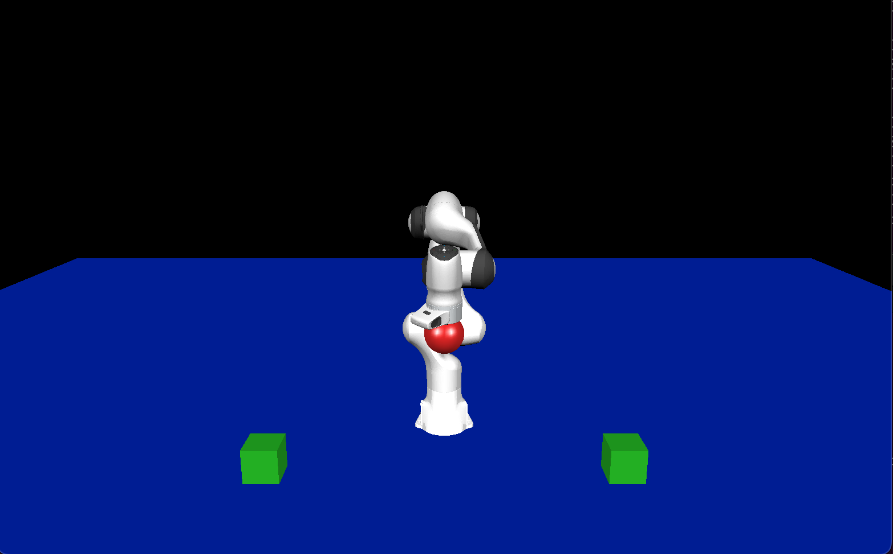

## Moving the camera

* Rotate the camera using the left mouse button and moving the mouse
* Pan the camera by pressing the mid button of the mouse and moving it, using the arrow keys, or maintaining the `Ctrl` key pressed and using the left mouse button
* Zoom in and out with the mouse wheel, the keys `a` and `z`, or maintaining the `Shift` key pressed and using the left mouse button

* Print the current camera position, lookat and vertical to the terminal by pressing the `s` key (useful to record a good camera angle and set it in a world file)
* Cycle between the camera (if there are several cameras) by pressing the `n` (next camera) and `b` (previous camera) keys

## Interact with the robot

* Right click on a robot or object and drag it around to apply a force in the virtual world (it will show as a green line)
* Use `Shift` + rught click to apply a moment (it will show as a red line)
* Move the force or moment end point in and out of the plane using the mouse wheel while applying a force or moment
# Web browser interface

When starting the panda example and opening the web browser at the correct url, you should see something like:
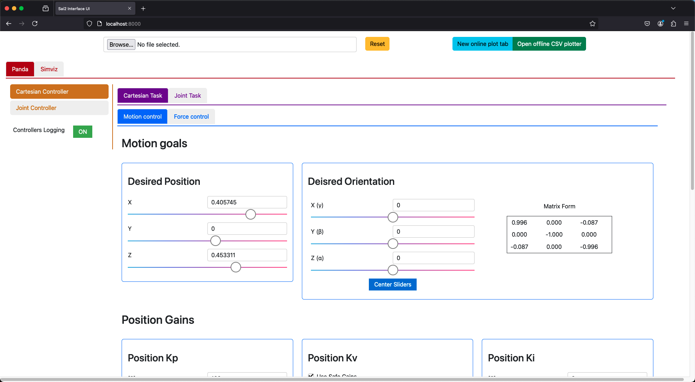

Let's go over the different elements.

## Config selector and plotters

At the top of the page, we will always have those 2 elements. The cofig selector on the left allows to reset the simulation/controllers, and to select a new config file to run.
Click on the `Browse` button, or on the input box to its right and it will open a window to select a file. __WARNING__: Only files that are in the config folder can be used. If the file is somewhere else, it will not work.

Press the yellow `Reset` button to switch to the new config file, or to reset the current simulation if no file is selected.

On the right, there is a double button that allows to either open an online plot tab that allows to plot the redis keys in real time, or to open a program that can plot the contents of vsc files, such as the ones created by the logger.

## Selection of robot or simviz

Just below the config selector and plot button, you will find red tabs that enable the selection of the robot whose controllers we want to interact with, or the simviz. If there are multiple robots in the world, there will be one tab per robot.

### Controller selection

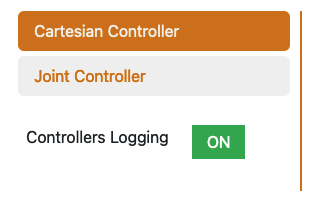

When a robot is selected, you will find in orange on the left the selection of the active controller. Those tab names are the controller names and clicking one will make that controller active. There is also a toggle button to start that robot controllers logging, or to stop it.

#### Task selection

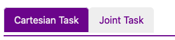

When a controller that has multiple tasks is seected, the purple tabs enable to select the task we want to interact with. This is for minimizing the clutter on the screen and not have all tasks show at the same time, but unlike for the controllers, all the tasks are always active at the same time in a given controller. The task names are the ones defined in the config.

##### Motion Force task

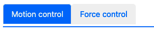

When the task is a motion force task, there is yet another tab level (in blue) to display the parameters for interacting with the motion part of the controller, or its force part. Both are always active at the same time (provided the task is parametrixed to control motions in some directions and forces in other directions)

##### Motion control

* Goal Position: set the goal position with sliders. The slider bounds can be defined in the config file

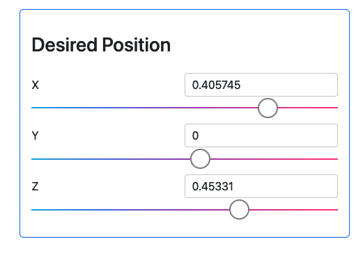

* Goal Orientation: set the orientation goal by rotating around fixed x, y, z axis using sliders. The `Center Sliders` button is to reset the sliders to zero without changing the goal orientation

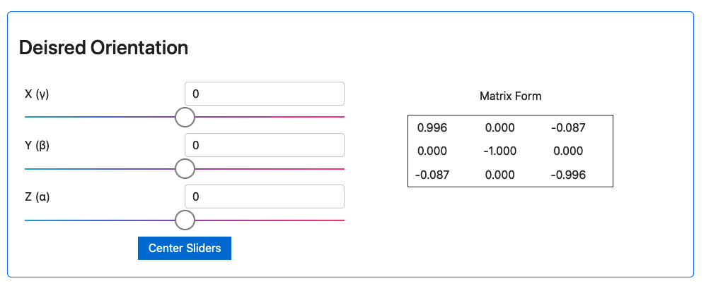

* Position gains: change the PID gains for the position control using sliders. If the gains are non isotropic, 3 sliders will appear. Uncheck the `Use safe gains` bos to enable the setting of a negative kv

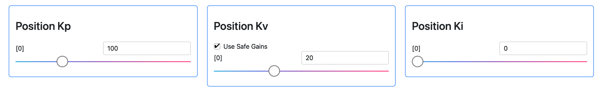

* Orientation Gains: change the PID gains for the orientation control using sliders. If the gains are non isotropic, 3 sliders will appear. Uncheck the `Use safe gains` bos to enable the setting of a negative kv

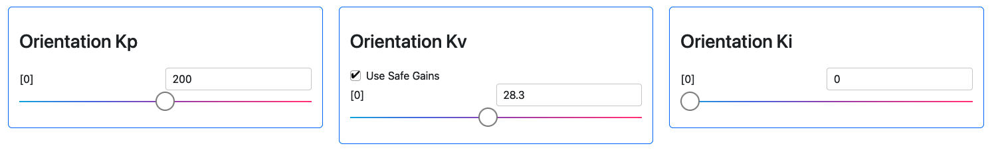

* Online trajectory generation parameters: Enable (green) or disable (red) the internal online trajectory generation by clicking on the `Use OTG` button. When enabled, change the velocity and acceleration limits using sliders, and check the `Use jerk limits` box to also enable and select jerk limits.

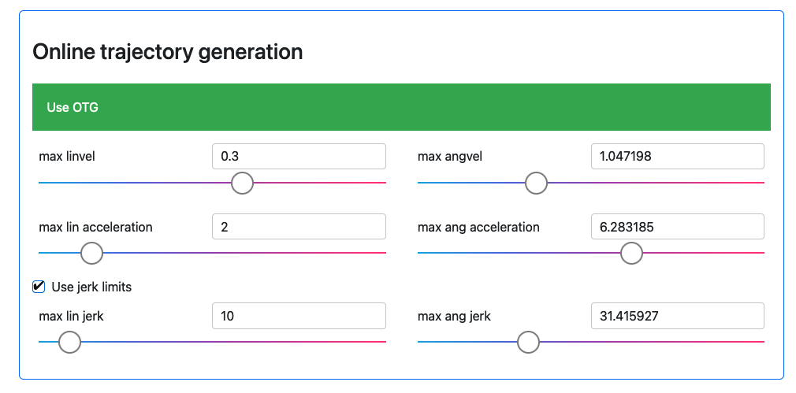

* Dynamic decoupling and velocity saturation: click the toggle button `Use Dynamic Decoupling` to enable or disable dynamic decoupling. Click the `Use Velocity Saturation` button to enable/disable velocity saturation. When enabled, change the velocity limit using sliders.

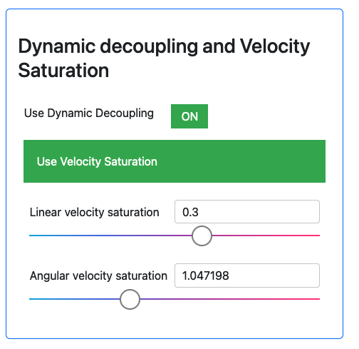

##### Force control

* Closed loop force control: use the toggle button to use open loop or closed loop force control.

* Force and moment space parametrization: select the force space dimension (between 0, full motion control, and 3, full force control) which will determine how many directions are controlled in force and how many in motion. When it is 1 or 2, select the axis for the control type that only one direction (force is the dimension is 1 and motion if the dimension is 2). When changing the axis, press enter or the `Update` button for the change to take effect. The axis will be normalized.

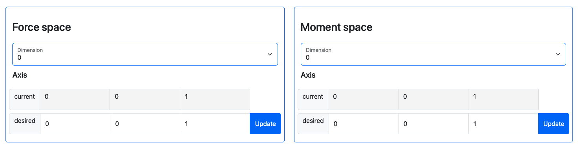

* Force and moment goals: Select the desired force and moments (will only be taken into account if it is not orthogonal to the force or moment space) using sliders. The slider bounds can be defined in the config file.

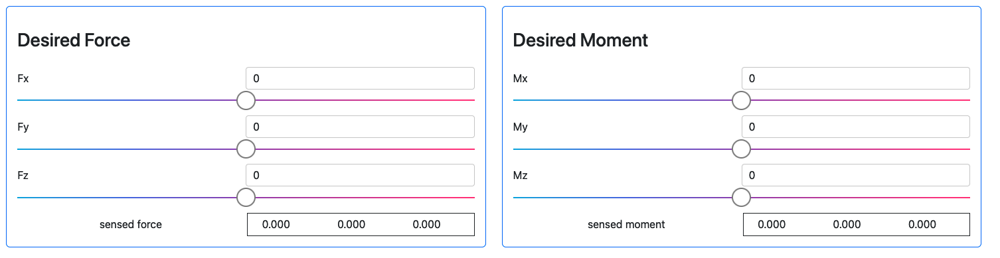

* Force gains: select the force gains using sliders. The kv is a velocity dmaping gain, it is not based on the derivative of the sensed force. Only useful if using closed loop force control.

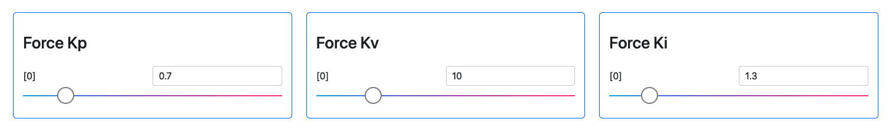

* Moment gains: select the moment gains using sliders. The kv is a velocity dmaping gain, it is not based on the derivative of the sensed moment. Only useful if using closed loop force control.

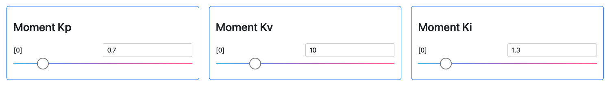

##### Joint task

* Goal positions: Select the joint goal positions with sliders. The slider names will adjust to the joint names and if it is a partial joint task, the number of sliders will adjust. The bounds are set from the robot joint limits in the robot urdf file.

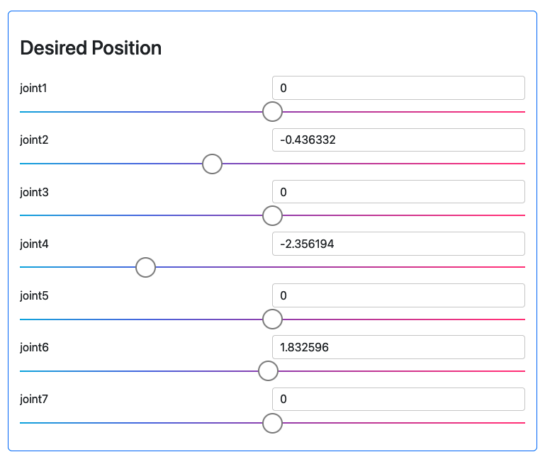

* Dynamic decoupling and velocity saturation: click the toggle button `Use Dynamic Decoupling` to enable or disable dynamic decoupling. Click the `Use Velocity Saturation` button to enable/disable velocity saturation. When enabled, change the velocity limit using sliders. If the velocity limits are defined per joint, there will be one slider per joint. Otherwise, all the joints use the same limit.

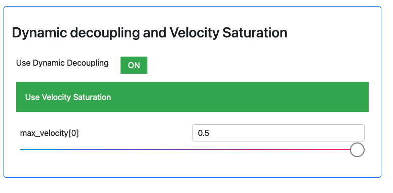

* Gains: change the PID gains for the joint position control using sliders. If the gains are non isotropic, several sliders will appear. Uncheck the `Use safe gains` bos to enable the setting of a negative kv

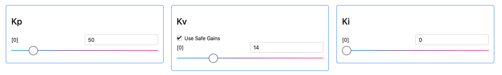

* Online trajectory generation parameters: Enable (green) or disable (red) the internal online trajectory generation by clicking on the `Use OTG` button. When enabled, change the velocity and acceleration limits using sliders, and check the `Use jerk limits` box to also enable and select jerk limits. If the velocity, acceleration or jerk limits are defined per joint, there will be one slider per joint. Otherwise, all the joints use the same limits.

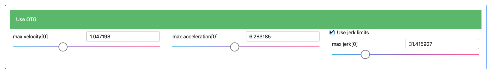
